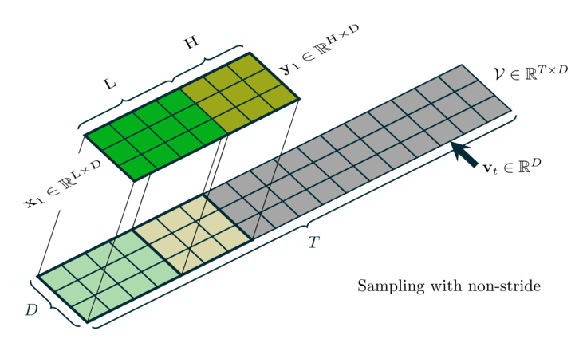
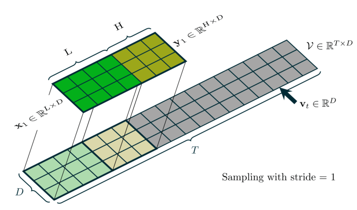

# Time Series Sliding-Window Sampling — Supplementary Material

This repository contains **dynamical visualizations** of sliding-window sampling for multivariate time series, as referenced in the paper. The animations illustrate how input windows (X) and target windows (Y) are extracted from a continuous sequence when building supervised pairs for sequence-to-sequence or forecasting models.

## Dynamical Visualizations

We provide two animated demonstrations (GIFs):

| Type | Description |
|---------------|-------------|
| **Non-stride sampling** | The window moves **one time step** at a time (stride = 0). Each frame shows one (X, Y) pair: X has length \(L\) (input context), Y has length \(H\) (target horizon), and they are adjacent along the time axis with no gap and no overlap. |
| **Strided sampling** | The window advances by **stride $\ge$ 1** time steps. This reduces the number of (X, Y) pairs. |

### Non-stride sampling



### Strided sampling



In both animations:
- **X** and **Y** are highlighted in distinct colors to show the exact segments used as input and target for each pair.
- Frames correspond to consecutive (X, Y) pairs as the sliding window moves along the sequence.

These visualizations complement the paper’s description of how non-stride vs strided sliding-window sampling is defined and used in our experiments.

## Contents

- **`gif/`** — Animated GIFs (non-stride and strided).
- **`pdf/`**, **`png/`** — Per-frame figures (PDF and PNG) for each animation.
- **`tex/`** — LaTeX source for each frame (generated from templates).
- **`timeseries/`** — Python scripts to generate the figures and GIFs.
- **`templates/`** — LaTeX templates for the time series figures.

## Regenerating the Figures and GIFs

Requirements: Python 3, `pdflatex`, and ImageMagick (`convert` or `magick convert`).

From the repository root:

```bash
# Generate all frames, compile PDFs, and build both GIFs
python3 timeseries/timeseries_draw.py all --compile-pdf --generate-gif
```

See `timeseries/timeseries_draw.py` for options (e.g. generating only non-stride or only strided animations, or only LaTeX/PDF without GIF).

## Citation

If you use these visualizations or this code in your work, please cite the accompanying paper.
